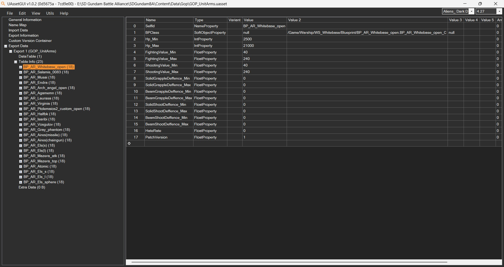
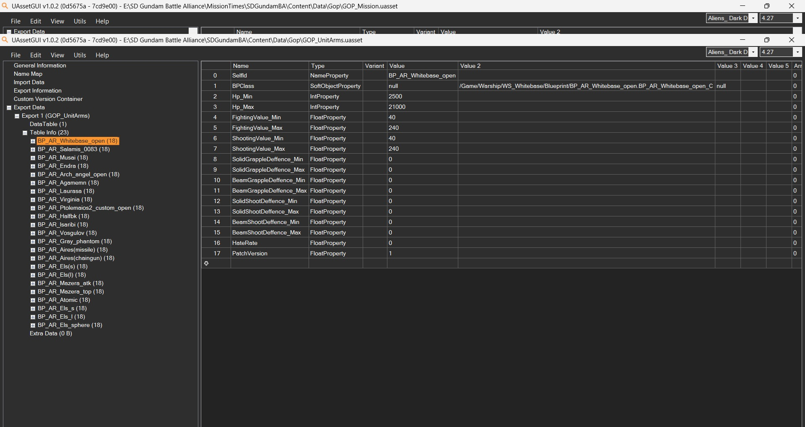
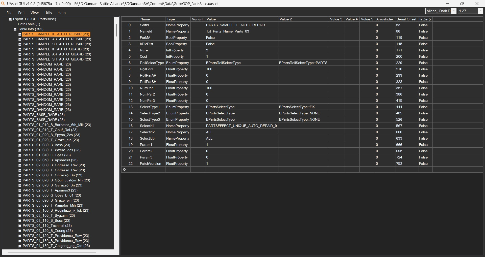
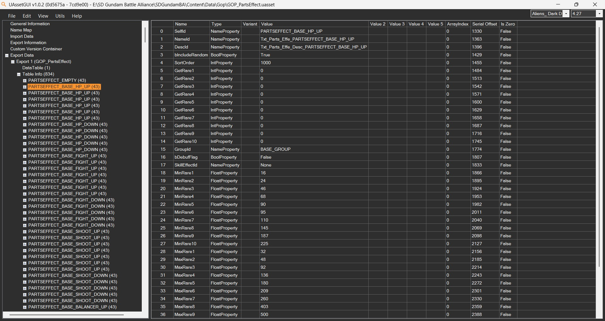
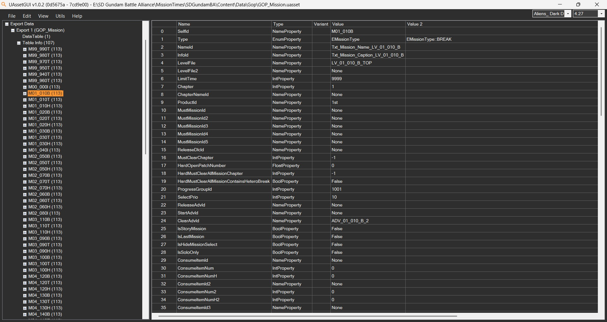
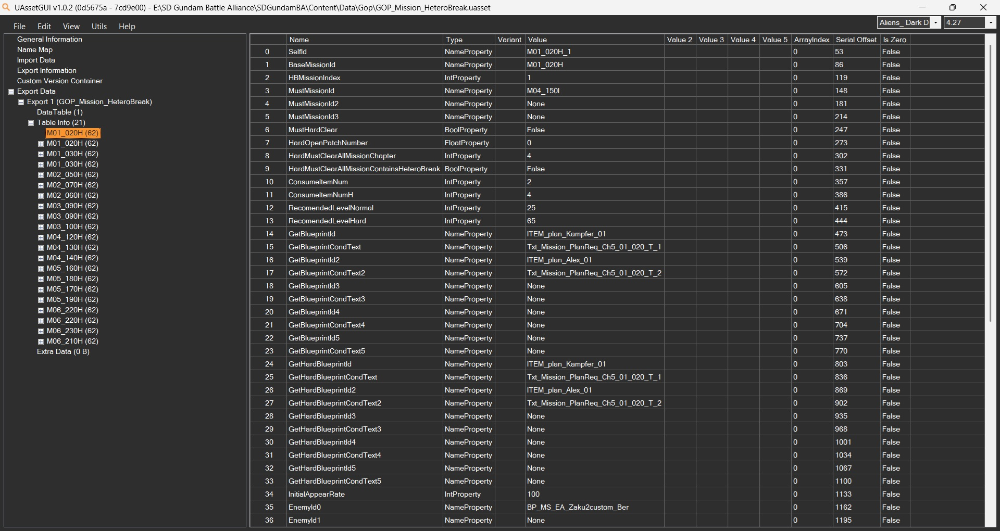

# Stat Locations

The game stores a wide variety of statistics in various data tables, which are basically Unreal Engine spreadhseets. Chagning specific values or outright deleting rows from these tables can alter the behavior of the game.

## GOP_UnitMS:
All mobile suit/mobile armor statistics, including Balance (hidden stagger stat).

By default, boss units have a Balance value of `1000000` (one million).

Edited GOP_UnitMS.uasset with boss `Balance` stat set to `200000` is available for use as a base mod file.

## GOP_UnitArms:
Controls ships, ELS, and Aires(?) stats.

## GOP_PartsBase:
Contains template for the randomly generated effects parts, as well as parts generated from defeating specific enemies.

`RollPar` numbers control part spawning based on unit role (Infighter, All-Rounder, Sharpshooter), `NumPar[1-3]` control some sort of value (base stat?), `Param[1-3]` are used in DLC parts. Interaction between `NumPar` and `Param` is unclear.

`SelectType[1-3]` controls how the effect for a part is chosen. Options are:
- `EPartsSelectType::NONE`
- `EPartsSelectType::FIX`
- `EPartsSelectType::FIX_AND_RANDOM_PARAM`
- `EPartsSelectType::RANDOM`

When using `EPartsSelectType::FIX`/`EPartsSelectType::FIX_AND_RANDOM_PARAM`, the corresponding `SelectId[1-3]` field **MUST** contain a `PARTSEFFECT_` value.

When using `EPartsSelectType::RANDOM`, the `SelectId[1-3]` field **MUST** contain one of the following values:
- `GroupId` value (see below) for `SelectId1`
- `ALL` for `SelectId2-3`

When using `EPartsSelectType::NONE`, the corresponding `SelectId[1-3]` field **MUST** contain an `ALL` value.

Using `EPartsSelectType::FIX_AND_RANDOM_PARAM` does **not** require a value to be set in the corresponding `Param#` field.

## GOP_PartsEffect:
Controls drop rates for effects when randomly generating effect parts (uncertain about this). Also tracks which ones are debuffs.

Known `GroupId` values: 
- BASE_GROUP
- ATK_GROUP
- WEAPON_GROUP
- REDUCE_GROUP
- GUARD_GROUP
- MOVE_GROUP
- RPAIR_GROUP
- DROP_GROUP
- HATE_GROUP
- DEBUFF_ONLY
- UDM_GROUP
- UNIQUE_GROUP

All buffs effects:

### PartsEffect and Param style:
Here is a chart showing various `PARTSEFFECT` types and their preferred `Param#` format:
| PARTSEFFECT                                  | Values         | PARAM   |
|----------------------------------------------|----------------|---------|
| PARTSEFFECT_BASE_HP_UP(_#)                    | Null, 1-4,9    | ###     |
| PARTSEFFECT_BASE_FIGHT_UP(_#)                 | Null, 1-5,9    |         |
| PARTSEFFECT_BASE_SHOOT_UP(_#)                 | Null, 1-5,9    | ###     |
| PARTSEFFECT_BASE_BALANCER_UP(_#)              | Null, 1-4,9    |         |
| PARTSEFFECT_ATK_PHYS_UP(_#)                   | Null, 1-4,9    |         |
| PARTSEFFECT_ATK_PHYS_GR_UP(_#)                | Null, 1-4,9    |         |
| PARTSEFFECT_ATK_PHYS_SH_UP(_#)                | Null, 1-4,9    |         |
| PARTSEFFECT_ATK_BEAM_UP(_#)                   | Null, 1-4,9    |         |
| PARTSEFFECT_ATK_BEAM_GR_UP(_#)                | Null, 1-4,9    |         |
| PARTSEFFECT_ATK_BEAM_SH_UP(_#)                | Null, 1-4,9    | 0.##    |
| PARTSEFFECT_ATK_WEAPON_UP(_#)                 | Null, 1-4,9    | 0.##    |
| PARTSEFFECT_ATK_SHOOT_UP(_#)                  | Null, 1-4,9    | 0.##    |
| PARTSEFFECT_ATK_UNIQUE_UP(_#)                 | Null, 1-4,9    |         |
| PARTSEFFECT_ATK_UNIQUE1_UP(_#)                | Null, 1-4,9    |         |
| PARTSEFFECT_ATK_UNIQUE2_UP(_#)                | Null, 1-4,9    |         |
| PARTSEFFECT_RELOAD_WEAPON_UP(_#)              | Null, 1-4,9    | 0.##    |
| PARTSEFFECT_RELOAD_SHOOT_UP(_#)               | Null, 1-4,9    |         |
| PARTSEFFECT_RELOAD_UNIQUE_UP(_#)              | Null, 1-4,9    |         |
| PARTSEFFECT_RELOAD_UNIQUE1_UP(_#)             | Null, 1-4,9    |         |
| PARTSEFFECT_RELOAD_UNIQUE2_UP(_#)             | Null, 1-3,9    |         |
| PARTSEFFECT_BULLET_WEAPON_UP(_#)              | Null, 1-4,9    | 0.##    |
| PARTSEFFECT_BULLET_SHOOT_UP(_#)               | Null, 1-4,9    |         |
| PARTSEFFECT_BULLET_UNIQUE_UP(_#)              | Null, 1-4,9    |         |
| PARTSEFFECT_BULLET_UNIQUE1_UP(_#)             | Null, 1-4,9    |         |
| PARTSEFFECT_BULLET_UNIQUE2_UP(_#)             | Null, 1-4,9    |         |
| PARTSEFFECT_REDUCE_PHYS_UP(_#)                | Null, 1-4,9    |         |
| PARTSEFFECT_REDUCE_PHYS_GR_UP(_#)             | Null, 1-4,9    |         |
| PARTSEFFECT_REDUCE_PHYS_SH_UP(_#)             | Null, 1-3,9    |         |
| PARTSEFFECT_REDUCE_BEAM_UP(_#)                | Null, 1-4,9    |         |
| PARTSEFFECT_REDUCE_BEAM_GR_UP(_#)             | Null, 1-4,9    |         |
| PARTSEFFECT_REDUCE_BEAM_SH_UP(_#)             | Null, 1-4,9    |         |
| PARTSEFFECT_REDUCE_GR_UP(_#)                  | Null, 1-4,9    | #.#     |
| PARTSEFFECT_REDUCE_SH_UP(_#)                  | Null, 1-4,9    | #.#     |
| PARTSEFFECT_REDUCE_BACK_UP(_#)                | Null, 1-3,9    |         |
| PARTSEFFECT_GUARD_SPEC_UP(_#)                 | Null, 1-4,9    |         |
| PARTSEFFECT_GUARD_RANGE_UP(_#)                | Null, 4,9      | #       |
| PARTSEFFECT_GUARD_GUAGE_UP(_#)                | Null, 1-4,9    | ##      |
| PARTSEFFECT_GUARD_RESTORE_UP(_#)              | Null, 1-3,9    | #       |
| PARTSEFFECT_GUARD_JUSTGUARD_TIME_UP(_#)       | Null, 4, 9     |         |
| PARTSEFFECT_GUARD_JUSTGUARD_SP_ADD_UP(_#)       | Null, 1-4,9    | #       |
| PARTSEFFECT_BOOST_STEP_UP_4                  | None           |         |
| PARTSEFFECT_BOOST_VALUE_UP(_#)               | Null, 1-4,9    | ##      |
| PARTSEFFECT_BOOST_STEP_INVINCIBLE_TIME_UP(_#)  | Null, 4, 9     | 0.##    |
| PARTSEFFECT_REPAIR_VALUE_UP(_#)              | Null, 1-4,9    | ##      |
| PARTSEFFECT_REPAIR_COUNT_UP(_#)              | Null, 1-2,9    |         |
| PARTSEFFECT_REPAIR_REPAIR_DOWN(_#)           | Null, 1-4,9    |         |
| PARTSEFFECT_REPAIR_RESTORE_DOWN(_#)          | Null, 1-4,9    |         |
| PARTSEFFECT_REPAIR_RESTORE_SELF_DOWN(_#)     | Null, 1-4,9    |         |
| PARTSEFFECT_REPAIR_RESTORE_FRIEND_DOWN(_#)   | Null, 1-4,9    |         |
| PARTSEFFECT_REPAIR_HEAL_ALL(_#)              | Null, 1-4,9    | ##      |
| PARTSEFFECT_OTHER_DROP_CAPITAL_UP(_#)         | Null, 1-4,9    | #####   |
| PARTSEFFECT_BOOSTCOST_ALLMOVE_DOWN(_#)        | Null, 1-4,9    |         |
| PARTSEFFECT_BOOSTCOST_DASH_DOWN(_#)           | Null, 1-3,9    | ##      |
| PARTSEFFECT_BOOSTCOST_STEP_DOWN(_#)           | Null, 1-3,9    |         |
| PARTSEFFECT_BOOSTCOST_JUMP_DOWN(_#)           | Null, 1-3,9    |         |
| PARTSEFFECT_BOOSTCOST_GR_ALL_DOWN(_#)         | Null, 1-4,9    | ##      |
| PARTSEFFECT_BOOSTCOST_GR_NORMAL_DOWN(_#)      | Null, 1-4,9    |         |
| PARTSEFFECT_BOOSTCOST_GR_SPECIAL_DOWN(_#)     | Null, 1-3,9    |         |
| PARTSEFFECT_BOOSTCOST_GR_SPIN_DOWN(_#)        | Null, 1-3,9    |         |
| PARTSEFFECT_BOOSTCOST_GR_LAUNCHER_DOWN(_#)      | Null, 1-3,9    |         |
| PARTSEFFECT_BOOSTCOST_GR_SMASH_DOWN(_#)         | Null, 1-3,9    |         |
| PARTSEFFECT_BALANCEDMG_ALL_UP(_#)            | Null, 1-4,9    | ##      |
| PARTSEFFECT_BALANCEDMG_BASIC_UP(_#)           | Null, 1-3,9    |         |
| PARTSEFFECT_BALANCEDMG_UNIQUE_UP(_#)           | Null, 1-4,9    |         |
| PARTSEFFECT_BALANCEDMG_UNIQUE_1_UP(_#)         | Null, 1-3,9    |         |
| PARTSEFFECT_BALANCEDMG_UNIQUE_2_UP(_#)         | Null, 1-3,9    |         |
| PARTSEFFECT_TENSIONDMG_ALL_UP(_#)             | Null, 1-4,9    |         |
| PARTSEFFECT_TENSIONDMG_BASIC_UP(_#)            | Null, 1-3,9    |         |
| PARTSEFFECT_TENSIONDMG_UNIQUE_UP(_#)            | Null, 1-3,9    |         |
| PARTSEFFECT_TENSIONDMG_UNIQUE_1_UP(_#)          | Null, 1-3,9    |         |
| PARTSEFFECT_TENSIONDMG_UNIQUE_2_UP(_#)          | Null, 1-3,9    |         |
| PARTSEFFECT_BARRIERDMG_ALL_UP(_#)             | Null, 1-4,9    | ##      |
| PARTSEFFECT_BARRIERDMG_BASIC_UP(_#)            | Null, 1-3,9    |         |
| PARTSEFFECT_BARRIERDMG_UNIQUE_UP(_#)            | Null, 1-3,9    |         |
| PARTSEFFECT_BARRIERDMG_UNIQUE_1_UP(_#)          | Null, 1-3,9    |         |
| PARTSEFFECT_BARRIERDMG_UNIQUE_2_UP(_#)          | Null, 1-3,9    |         |
| PARTSEFFECT_LOCATIONDMG_BACK_UP(_#)           | Null, 1-4,9    | 0.##    |
| PARTSEFFECT_LOCATIONDMG_AIR_UP(_#)            | Null, 1-4,9    |         |
| PARTSEFFECT_UNIQUE_SUPERARMOR(_#)             | Null, 9       |         |
| PARTSEFFECT_UNIQUE_AUTO_REPAIR(_#)            | Null, 9       | 1       |
| PARTSEFFECT_UNIQUE_AUTO_GUARD(_#)             | Null, 9       | 1       |

## GOP_Missions:
Controls mission timer, what enemies are displayed on the selection screen.

Set `EnableTimeLimit` to 9999 and `EnableTimeLimit` to `EMissionEnable::DISABLE` to disable mission timers.

`CollectItemTime` controls the gap between end of mission and auto-exit.

`EnemyId0` through `EnemyId23` control the enemies that display on the mission select screen. Enemies display from left to right based on their number. `EnemyId0` will always be the last unit displayed on the right.

`EnemyId#` DOES NOT control spawns. It exists to alert players to what rare/important enemies appear in the mission.

TBD: Whether spawns are controlled by `LevelFile`.

Edited GOP_Mission.uasset with unlimited mission time and `CollectItemTime` set to 60 is available for use as a base mod file.

## GOP_Mission_HetereoBreak:
Seems to control variants of Chaos missions. Duplicates many fields from GOP_Mission.
